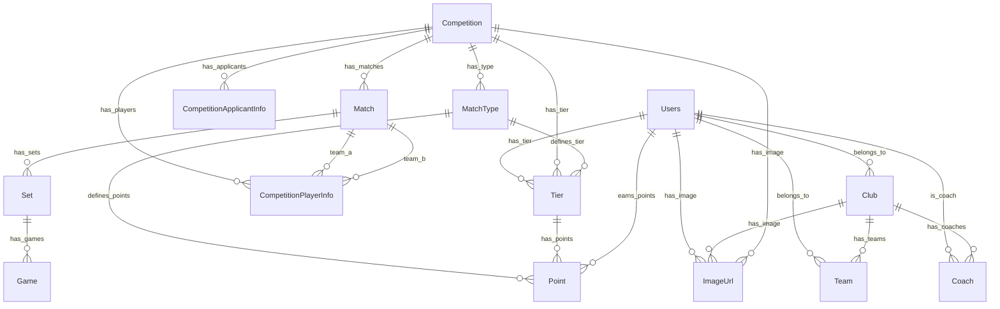

# 🎾 Alchemist Tennis App

테니스 대회 관리 및 클럽 운영을 위한 Django REST API 서비스입니다.

## 📋 목차

- [프로젝트 개요](#프로젝트-개요)
- [기술 스택](#기술-스택)
- [주요 기능](#주요-기능)
- [프로젝트 구조](#프로젝트-구조)
- [데이터베이스 설계](#데이터베이스-설계)
- [API 문서](#api-문서)
- [환경 설정](#환경-설정)

## 🎯 프로젝트 개요

테니스 클럽과 대회를 관리하는 종합적인 플랫폼입니다. 
사용자들은 클럽에 가입하고, 대회에 참가하며, 경기 결과를 확인할 수 있습니다.
관리자는 회원 관리, 대회 관리, 경기 결과를 관리할 수 있습니다.


### 주요 서비스
- **사용자 관리**: 회원가입, 로그인, 프로필 관리
- **클럽 관리**: 클럽 정보, 팀 관리, 코치 관리
- **대회 관리**: 대회 생성, 참가 신청, 경기 일정 관리
- **경기 관리**: 경기 결과 기록, 점수 관리
- **티어 시스템**: 사용자 실력 등급 관리

## 🛠 기술 스택

### Backend
- **Python 3.12**
- **Django 5.0.4** - 웹 프레임워크
- **Django REST Framework 3.15.1** - API 개발
- **Django REST Framework Simple JWT 5.3.1** - JWT 인증
- **PyMySQL 1.1.0** - MySQL 데이터베이스 연결
- **Pillow 10.3.0** - 이미지 처리
- **Boto3 1.34.108** - AWS S3 파일 저장

### 개발 도구
- **Poetry** - 의존성 관리
- **Django CORS Headers 4.3.1** - CORS 설정
- **DRF Camel Case 1.4.2** - JSON 필드명 카멜케이스 변환
- **DRF YASG 1.21.7** - Swagger API 문서 자동 생성
- **Django Environ 0.11.2** - 환경변수 관리

### 인프라
- **SQLite** (개발 환경)
- **AWS S3** - 파일 저장소
- **Docker** (선택사항)

## 🚀 주요 기능

### 1. 사용자 관리
- JWT 기반 인증 시스템
- 커스텀 사용자 모델 (전화번호 기반 로그인)
- Soft deleted로 데이터 관리
- 프로필 이미지 관리

### 2. 클럽 및 팀 관리
- 클럽 정보 등록 및 관리
- 팀 생성 및 관리
- 코치 지정 및 관리
- 클럽별 이미지 관리

### 3. 대회 관리
- 토너먼트/리그 형식 대회 생성
- 대회 참가 신청 및 관리
- 참가비 관리 (입금 확인)
- 대회 일정 및 규칙 관리

### 4. 경기 관리
- 경기 일정 관리
- 세트별 점수 기록
- 게임별 상세 점수 관리
- 경기 결과 통계

### 5. 티어 시스템
- 성별/경기 유형별 티어 관리
- 사용자 실력 등급 시스템
- 포인트 시스템

## 📁 프로젝트 구조

```
alchemist/
├── config/                 # 프로젝트 설정
│   ├── settings.py        # Django 설정
│   ├── urls.py           # 메인 URL 설정
│   └── middleware.py     # 커스텀 미들웨어
├── core/                  # 공통 모델 및 유틸리티
│   ├── models.py         # TimeStampedModel, SoftDeleteModel
│   └── log_middleware.py # 로깅 미들웨어
├── users/                 # 사용자 관리
├── club/                  # 클럽 관리
├── team/                  # 팀 관리
├── competition/           # 대회 관리
├── match/                 # 경기 관리
├── tier/                  # 티어 시스템
├── matchtype/             # 경기 유형 관리
├── image_url/             # 이미지 관리
├── applicant/             # 대회 신청자 관리
├── participant/           # 대회 참가자 관리
└── manage.py
```

## 🗄 데이터베이스 설계

### ERD (Entity Relationship Diagram)



### 테이블 명세서

#### 1. Users (사용자)
| 필드명 | 타입 | 설명 | 제약조건 |
|--------|------|------|----------|
| id | AutoField | 기본키 | Primary Key |
| username | CharField(255) | 사용자명 | Required |
| phone | CharField(255) | 전화번호 | Unique, Required |
| password | CharField(255) | 비밀번호 | Required |
| gender | CharField(255) | 성별 | Choices: male/female |
| birth | IntegerField | 출생년도 | 1900-2050 |
| auth | CharField(255) | 권한 | Optional |
| club | ForeignKey | 소속 클럽 | Optional |
| team | ForeignKey | 소속 팀 | Optional |
| tier | ForeignKey | 티어 | Optional |
| image_url | ForeignKey | 프로필 이미지 | Optional |
| is_staff | BooleanField | 관리자 권한 | Default: False |
| is_active | BooleanField | 활성화 상태 | Default: True |
| is_deleted | BooleanField | 삭제 여부 | Default: False |
| created_at | DateTimeField | 생성일시 | Auto |
| updated_at | DateTimeField | 수정일시 | Auto |

#### 2. Club (클럽)
| 필드명 | 타입 | 설명 | 제약조건 |
|--------|------|------|----------|
| id | AutoField | 기본키 | Primary Key |
| name | CharField(30) | 클럽명 | Required |
| address | CharField(100) | 주소 | Optional |
| phone | CharField(30) | 연락처 | Optional |
| description | CharField(100) | 설명 | Optional |
| image_url | ForeignKey | 클럽 이미지 | Optional |
| is_deleted | BooleanField | 삭제 여부 | Default: False |
| created_at | DateTimeField | 생성일시 | Auto |
| updated_at | DateTimeField | 수정일시 | Auto |

#### 3. Competition (대회)
| 필드명 | 타입 | 설명 | 제약조건 |
|--------|------|------|----------|
| id | AutoField | 기본키 | Primary Key |
| name | CharField(30) | 대회명 | Required |
| status | CharField(15) | 상태 | Choices: before/during/ended |
| competition_type | CharField(10) | 대회 유형 | Choices: tournament/league |
| start_date | DateTimeField | 시작일시 | Optional |
| end_date | DateTimeField | 종료일시 | Optional |
| total_rounds | IntegerField | 총 라운드 수 | Optional |
| total_sets | IntegerField | 총 세트 수 | Optional |
| description | CharField(100) | 설명 | Optional |
| rule | TextField | 규칙 | Optional |
| address | CharField(100) | 주소 | Optional |
| location | CharField(30) | 장소 | Optional |
| code | CharField(100) | 대회 코드 | Optional |
| phone | CharField(30) | 연락처 | Optional |
| fee | IntegerField | 참가비 | Optional |
| bank_name | CharField(30) | 은행명 | Optional |
| bank_account_number | CharField(30) | 계좌번호 | Optional |
| bank_account_name | CharField(30) | 예금주 | Optional |
| site_link | TextField | 사이트 링크 | Optional |
| max_participants | IntegerField | 최대 참가자 수 | Default: 0 |
| deposit_date | IntegerField | 입금 기한(일) | Optional |
| match_type | ForeignKey | 경기 유형 | Required |
| tier | ForeignKey | 티어 | Required |
| image_url | ForeignKey | 대회 이미지 | Optional |
| is_deleted | BooleanField | 삭제 여부 | Default: False |
| created_at | DateTimeField | 생성일시 | Auto |
| updated_at | DateTimeField | 수정일시 | Auto |

#### 4. Match (경기)
| 필드명 | 타입 | 설명 | 제약조건 |
|--------|------|------|----------|
| id | AutoField | 기본키 | Primary Key |
| match_round | IntegerField | 라운드 | Optional |
| match_number | IntegerField | 경기 번호 | Optional |
| court_number | IntegerField | 코트 번호 | Optional |
| competition | ForeignKey | 대회 | Required |
| a_team | ForeignKey | A팀 | Required |
| b_team | ForeignKey | B팀 | Required |
| is_deleted | BooleanField | 삭제 여부 | Default: False |
| created_at | DateTimeField | 생성일시 | Auto |
| updated_at | DateTimeField | 수정일시 | Auto |

#### 5. Set (세트)
| 필드명 | 타입 | 설명 | 제약조건 |
|--------|------|------|----------|
| id | AutoField | 기본키 | Primary Key |
| set_number | IntegerField | 세트 번호 | Optional |
| score_a | IntegerField | A팀 점수 | Optional |
| score_b | IntegerField | B팀 점수 | Optional |
| match | ForeignKey | 경기 | Required |
| created_at | DateTimeField | 생성일시 | Auto |
| updated_at | DateTimeField | 수정일시 | Auto |

#### 6. Game (게임)
| 필드명 | 타입 | 설명 | 제약조건 |
|--------|------|------|----------|
| id | AutoField | 기본키 | Primary Key |
| game_number | IntegerField | 게임 번호 | Optional |
| score_a | IntegerField | A팀 점수 | Optional |
| score_b | IntegerField | B팀 점수 | Optional |
| set | ForeignKey | 세트 | Required |
| created_at | DateTimeField | 생성일시 | Auto |
| updated_at | DateTimeField | 수정일시 | Auto |

#### 7. MatchType (경기 유형)
| 필드명 | 타입 | 설명 | 제약조건 |
|--------|------|------|----------|
| id | AutoField | 기본키 | Primary Key |
| gender | CharField(6) | 성별 | Choices: male/female/mix/team |
| type | CharField(6) | 경기 유형 | Choices: single/double/team |
| created_at | DateTimeField | 생성일시 | Auto |
| updated_at | DateTimeField | 수정일시 | Auto |

#### 8. Tier (티어)
| 필드명 | 타입 | 설명 | 제약조건 |
|--------|------|------|----------|
| id | AutoField | 기본키 | Primary Key |
| name | CharField(255) | 티어명 | Optional |
| match_type | ForeignKey | 경기 유형 | Required |
| is_deleted | BooleanField | 삭제 여부 | Default: False |
| created_at | DateTimeField | 생성일시 | Auto |
| updated_at | DateTimeField | 수정일시 | Auto |

## 📚 API 문서

### Swagger UI
- **개발 환경**: http://127.0.0.1:8000/swagger/
- **ReDoc**: http://127.0.0.1:8000/redoc/


## 🔧 개발 가이드

### 코드 컨벤션
- Python: PEP 8 준수
- Django: Django 코딩 스타일 가이드 준수
- API 응답: CamelCase 사용 (djangorestframework-camel-case)

### 로깅
- 요청/응답 로깅: `core.log_middleware.LogRequestMiddleware`
- 로그 설정: `config/loggers.py`

## 개선 필요사항
- 테스트 코드 작성
- 모델링 시 옵션 재설정으로 데이터 무결성 방지 (DO_NOTHING으로 쓰이는 부분이 있음)
- 구체적인 예외 처리
- [완료] temp_models.py 삭제
- 사용하지 않는 import 삭제 (black, mypy 도입)
- 공통 유틸리티 분리
- 쿼리 최적화 (인덱스 추가, N+1 쿼리 문제 해결)
- 환경별 설정 파일 생성


---

**Alchemist Tennis App** - 테니스 커뮤니티를 위한 플랫폼 🎾 